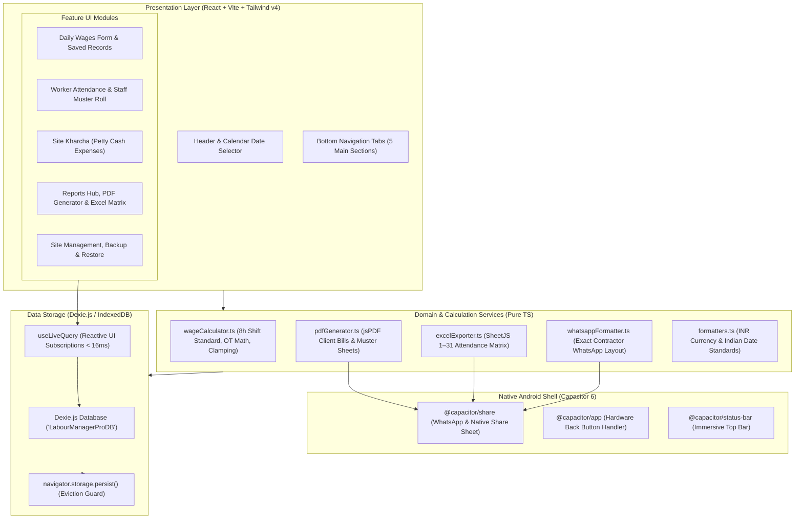

# Technical Architecture & System Design (ARCHITECTURE.md)
## Labour Manager Pro (लेबर मैनेजर प्रो)

**Architecture Type:** Offline-First Progressive Web App (PWA) + Capacitor 6 Android Shell  
**Core Technologies:** React 18/19, Vite, TypeScript, Tailwind CSS v4, Dexie.js (IndexedDB), jsPDF, SheetJS (XLSX), i18next  
**Runtime:** 100% Client-Side / Zero Cloud Servers / Zero Backend API Needed

---

## 1. High-Level Architecture Diagram



---

## 2. Directory Structure & File Map

```text
e:/sonu/
├── src/
│   ├── components/
│   │   ├── daily-wage/
│   │   │   ├── HeadcountEntryForm.tsx   # Single-screen wage form & date restriction guard
│   │   │   ├── RateGroupCard.tsx        # Dynamic rate group card with OT inputs & placeholders
│   │   │   ├── DailyWageHistoryList.tsx # Collapsible saved records list with Edit action
│   │   │   └── EntrySubmittedModal.tsx  # Post-save summary popup (WhatsApp & Excel Matrix)
│   │   ├── roster/
│   │   │   ├── WorkerAttendanceList.tsx # Worker roster, 1-tap attendance & Muster PDF export
│   │   │   └── WorkerFormModal.tsx      # Add/edit named worker modal
│   │   ├── petty-cash/
│   │   │   ├── PettyCashForm.tsx        # Fast expense entry (Cash/UPI tags)
│   │   │   └── PettyCashList.tsx        # Date-wise expense list & delete
│   │   ├── reports/
│   │   │   └── ReportsView.tsx          # Date range filters, KPI cards, PDF & Excel buttons
│   │   ├── settings/
│   │   │   └── SettingsView.tsx         # Backup/restore JSON, language, site switch
│   │   └── layout/
│   │       ├── Header.tsx               # Top bar, site selector button, calendar picker
│   │       ├── BottomNav.tsx            # 5-tab bottom navigation bar
│   │       └── SiteSelectorModal.tsx    # Create, switch, and edit site names/locations
│   ├── db/
│   │   ├── index.ts                     # Dexie database class & table definitions
│   │   ├── hooks.ts                     # Reactive live query hooks (useDailyHeadcount, etc.)
│   │   └── seed.ts                      # Default initial site & settings creation
│   ├── services/
│   │   ├── pdfGenerator.ts              # jsPDF labour bill & muster roll generation
│   │   └── excelExporter.ts             # SheetJS multi-sheet Excel & Attendance Matrix
│   ├── utils/
│   │   ├── wageCalculator.ts            # 8-hour shift OT math & defensive clamping
│   │   ├── whatsappFormatter.ts         # WhatsApp message text builder
│   │   └── formatters.ts                # formatINR, formatPDFCurrency, formatDateDMY
│   ├── i18n/                            # English & Hindi bilingual translations
│   ├── App.tsx                          # Root orchestrator & active tab manager
│   └── main.tsx                         # React entry point
└── docs/                                # Project documentation hub
```

---

## 3. Database Tables (`LabourManagerProDB`)

| Table Name | Indexed Fields | Stored Information |
| :--- | :--- | :--- |
| **`sites`** | `id, name, status, createdAt` | Construction site projects (name, location, status). |
| **`headcountEntries`** | `id, siteId, date, createdAt` | Daily wage records, multi-rate groups, total workers, total wage. |
| **`namedWorkers`** | `id, siteId, name, role, status` | Registered staff & worker profiles with trade roles and default rates. |
| **`workerAttendance`** | `id, siteId, workerId, date, status` | Daily attendance (`full`, `half`, `absent`), OT hours, earned wage. |
| **`pettyExpenses`** | `id, siteId, date, category` | Daily site kharcha (amount, category, description, Cash/UPI). |
| **`settings`** | `id` | Global active site ID, standard shift hours (8h), app language. |

---

## 4. Key Engineering Invariants

1. **Standard 8-Hour Shift Math:**
   - $\text{Hourly OT Rate} = \lfloor\text{Day Rate} / 8\rfloor$
   - $\text{OT Wage} = \text{OT Workers} \times \text{OT Hours} \times \text{Hourly OT Rate}$
2. **Defensive Auto-Clamping:**
   - $\text{OT Workers}$ cannot exceed the total worker count of that rate group.
3. **Date Restriction Architecture:**
   - If selected calendar date $\ne$ Today, the app switches to Saved Records mode and displays an informational lock banner with 1-click switch to Today.
   - Editing an existing entry is allowed on any date.
4. **PDF Font Compatibility:**
   - All PDF amounts use `Rs.` via `formatPDFCurrency` to avoid font rendering glitches.
