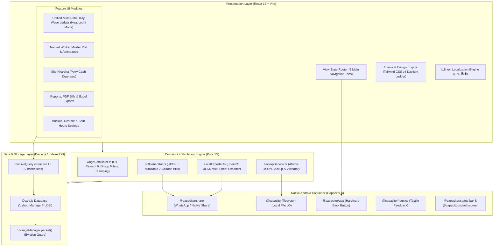

# Labour Manager Pro — Technical Architecture Specification

**Document Version:** 1.2.0  
**Target Architecture:** Offline-First Progressive Web App (PWA) wrapped with Capacitor 6 for Native Android  
**Core Principles:** Zero-cloud reliance, sub-16ms UI latency, absolute calculation precision, sunlight-readable high contrast, zero data loss.  
**Shift Standard:** Default 9 Hours ($\text{OT Rate} = \text{Day Rate} / 9$) with 8h/9h runtime toggle.

---

## 1. High-Level System Architecture



---

## 2. Database Schema & Data Models (`src/db/index.ts`)

```typescript
// Database Name: 'LabourManagerProDB'
// Database Version: 1

export interface Site {
  id: string; // UUID / site_timestamp
  name: string; // e.g. "Main Construction Site"
  location: string; // e.g. "Site Location"
  clientName?: string;
  startDate: string; // YYYY-MM-DD
  status: 'active' | 'completed' | 'archived';
  createdAt: number;
  updatedAt: number;
}

export interface RateGroup {
  id: string;
  workerType: 'mesan' | 'helper' | 'carpenter' | 'bar_bender' | 'other';
  customTitle?: string;
  count: number | '';
  dayRate: number | '';
  otWorkers: number | '';
  otHours: number | '';
  calculatedOtRate: number; // dayRate / 9
  calculatedGroupBase: number; // count * dayRate
  calculatedGroupOt: number; // otWorkers * otHours * (dayRate / 9)
  calculatedGroupTotal: number; // Base + OT
}

export interface HeadcountEntry {
  id: string;
  siteId: string;
  contractorId?: string;
  date: string; // YYYY-MM-DD
  groups: RateGroup[]; // Enriched with exact base, OT and totals
  totalWorkers: number;
  totalMesans: number;
  totalHelpers: number;
  totalWageAmount: number;
  notes?: string;
  createdAt: number;
  updatedAt: number;
}

export interface NamedWorker {
  id: string;
  siteId: string;
  contractorId?: string;
  name: string;
  phone?: string;
  role: 'mesan' | 'helper' | 'carpenter' | 'bar_bender' | 'plumber' | 'electrician' | 'painter';
  defaultDayRate: number;
  status: 'active' | 'inactive';
  createdAt: number;
}

export interface WorkerAttendance {
  id: string;
  siteId: string;
  workerId: string;
  workerName: string;
  workerRole: string;
  date: string; // YYYY-MM-DD
  status: 'full' | 'half' | 'absent';
  dayRate: number;
  otHours: number;
  calculatedWage: number;
  paymentStatus: 'pending' | 'paid';
  notes?: string;
  createdAt: number;
  updatedAt: number;
}

export interface PettyExpense {
  id: string;
  siteId: string;
  date: string; // YYYY-MM-DD
  category: 'cement_sand' | 'snacks_tea' | 'fuel' | 'tools' | 'transport' | 'materials' | 'other';
  description: string;
  amount: number;
  paymentMode: 'cash' | 'upi';
  vendorName?: string;
  createdAt: number;
}

export interface AppSettings {
  id: 'global_settings';
  activeSiteId: string;
  language: 'en' | 'hi';
  theme: 'light' | 'dark' | 'system';
  currencySymbol: string; // '₹'
  standardShiftHours: number; // Default: 9
  lastBackupDate?: number;
}
```

### 2.1. Dexie IndexedDB Store Definitions
```typescript
db.version(1).stores({
  sites: 'id, name, status, createdAt',
  contractors: 'id, siteId, name, trade',
  headcountEntries: 'id, siteId, contractorId, date, [siteId+date]',
  namedWorkers: 'id, siteId, contractorId, role, status',
  workerAttendance: 'id, siteId, workerId, date, [siteId+date], [workerId+date]',
  pettyExpenses: 'id, siteId, date, category, [siteId+date]',
  settings: 'id',
});
```

---

## 3. Mathematical & Calculation Invariants (`src/utils/wageCalculator.ts`)

1. **Hourly Overtime Rate:**
   $$\text{OT Rate per Hour} = \frac{\text{Day Rate}}{\text{Shift Hours (9)}}$$
2. **Rate Group Base Wage:**
   $$\text{Base Wage} = \text{Count} \times \text{Day Rate}$$
3. **Rate Group Overtime Wage:**
   $$\text{OT Wage} = \text{OT Workers} \times \text{OT Hours} \times \left(\frac{\text{Day Rate}}{9}\right)$$
4. **Rate Group Total:**
   $$\text{Group Total} = \text{Base Wage} + \text{OT Wage}$$
5. **Named Worker Full Day:**
   $$\text{Wage} = \text{Day Rate} + \left(\text{OT Hours} \times \frac{\text{Day Rate}}{9}\right)$$
6. **Named Worker Half Day:**
   $$\text{Wage} = (\text{Day Rate} \times 0.5) + \left(\text{OT Hours} \times \frac{\text{Day Rate}}{9}\right)$$
7. **Defensive Auto-Clamping:**
   $$\text{Clamped OT Workers} = \min(\text{Entered OT Workers}, \text{Group Count})$$

---

## 4. Export Pipelines & WhatsApp Integration

### 4.1. Client-Side PDF Generation (`src/services/pdfGenerator.ts`)
- Generates 100% offline A4 documents with company header, KPI summary blocks, itemized 7-column labour table, and petty cash breakdown.
- **Table Columns:** `[ Date | Labour Type | Count | Day Rate | Base Wage | Overtime (OT) | Group Total ]`.

### 4.2. Native WhatsApp Share Sheet Integration
- Passes the generated PDF blob directly to the native Android Share Sheet via Web Share API / `@capacitor/share`.

### 4.3. Multi-Sheet Excel Engine (`src/services/excelExporter.ts`)
- Generates `.xlsx` workbook containing Sheet 1 (Daily Wages with Base and OT details) and Sheet 2 (Site Expenses).
